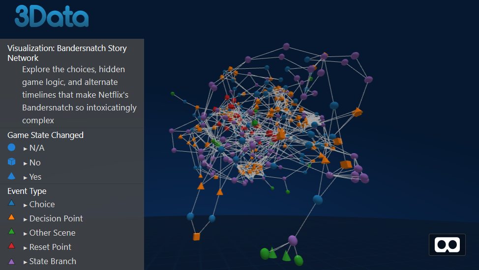

# Analyzing decision graphs from Netflix's Bandersnatch

I used R to parse the decision engine json data from Bandersnatch and format it for an immersive network visualziation in 3Data.

Special thanks to [KalenXI](https://github.com/KalenXI/Bandersnatch) for providing the json data and some valuable insights about how segment groups work.

[View the interactive, VR-enabled visuzliation powere by 3Data](https://fortress.3data.io/embed.html?room=5c363248152c622ab0c3cc3f&environment=tron-environment-blue&transparent=true)

## Files

* Bandersnatch.json - input data
* Bandersnatch.Rmd - parsing code
* bandersnatch network - output network viz formated data